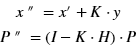

# Extended Kalman Filter Project

## 1. 原项目地址

本项目源自Udacity的Self Driving Car Engineer课程。

原项目地址为：[udacity/CarND-Extended-Kalman-Filter-Project: Self-Driving Car Nanodegree Program Starter Code for the Extended Kalman Filter Project (github.com)](https://github.com/udacity/CarND-Extended-Kalman-Filter-Project)

项目模拟了一辆行驶的汽车以及在汽车边上的一辆自行车的场景。并且提供了一份数据集，包含了车上不同传感器探测到的自行车的位置信息。项目要求需要通过“增强卡尔曼滤波器Extended Kalman Filter”进行“感知融合Sensor Fusion”后得到自行车的位置，并通过模拟器Simulator进行可视化的展示。

## 2. 模拟器

为了进行可视化展示，项目提供了一个[模拟器Simulator](https://github.com/udacity/self-driving-car-sim/releases "点击可跳转至下载链接")，可以直接下载到本地安装。

## 3. uWebSockets

如果只把原项目和模拟器下载到本地的话，大概率是编译不了的，原项目的main.cpp文件中的#include `<uWS/uWS.h>大概率是找不到的，`为了能让程序顺利编译，同时为了能让代码生成的结果和模拟器连接，还需要使用uWebSocketIO。但这玩意在windows上很麻烦。可以用vcpkg来下载安装，但我反正没成功，各种坑，多半和开发环境，工具链配置有关，最后选择了用Ubuntu Bash在windows上运行虚拟机来进行本地编译。

### 安装Ubuntu Bash

但这个软件只能用在Linux和Mac OS上，Windows上直接使用比较麻烦。我使用的是Window 10的系统，则需要对开发环境进行特殊的配置，通过安装Linux Bash来获得Linux的环境，从而更好的使用uWebSocketIO，点这里可以查看Win10上安装Ubuntu的[安装步骤](https://www.howtogeek.com/249966/how-to-install-and-use-the-linux-bash-shell-on-windows-10/ "点击可查看安装步骤")。

### 安装uWebSockets所需依赖库

安装好Ubuntu后，需要通过apt-get安装几个uWebSockets要的依赖库，包括cmake，libssl-dev，openssl之类的（之后编译的时候可能会弹出些错误，缺啥就装啥了，需要注意看log）

### 安装uWebSockets

安装好依赖库后，原项目的文件夹有一个install-ubuntu.sh的文件，直接运行应该是会自动安装好uWebSockets的，但我试了试并没有反应，所以就手动安装了。

回到用户目录下，通过git把uWebSockets的github仓库克隆下来，然后在uWebSockets的仓库的文件夹里面先用 `mkdir build`新建一个build文件夹，然后进到build里，然后用 `cmake.. && make`编译并运行一下，这样uWebSockets就算安装好了。过程会出几次错，一般是少了一些必要的库，用apt-get安装后再试试就行了，可能是g++，可能是libuv1.dev

### 试编译项目

为了检验各种依赖库是不是都装好了，可以再到项目的文件夹里尝试编译一下，可以编译并生成./ExtendedKF文件的话就没问题了。

> 此外本项目还需要使用到由奔驰提供的用于生成并可视化用于感知融合Sensor Fusion的应用，可以生成更多的数据，用于卡尔曼滤波器的学习，项目地址为：[udacity/CarND-Mercedes-SF-Utilities: Tools for Sensor Fusion processing. (github.com)](https://github.com/udacity/CarND-Mercedes-SF-Utilities)

## 4. 项目任务

### 本地开发

配置好环境后就可以愉快的进行本地开发了。虽然再Udacity的网站里可以通过他们提供的workspace特别简单的进行项目，所有环境都是配置好了的，我还是选择在本地开发了。一是因为网络问题，即不太稳定也不想一直连着网在线写代码；二是自己建立仓库再本地开发能更熟悉从搭建环境到编译运行的全过程；三是可以通过自己的仓库记录下整个项目过程，也方便以后回头来复习或者分享给别人。

另外需要注意的是，我个人不是很会在Ubuntu里写代码，于是还是用的VS code编辑器来编辑代码，然后通过git插件把代码同步到自己的仓库里，然后再回到Ubuntu Bash里pull一下，然后再编译看看结果。

需要完成代码的文件有FusionEKF.cpp，FusionEKF.cpp，FusionEKF.h，kalman_filter.cpp，kalman_filter.h， tools.cpp和tools.h，main.cpp是原项目提供的，无需修改。


### `kalman_filter.cpp`以及 `kalman_filter.h`

在 `kalman_fitler.h`的头文件中，定义了 ` class KalmanFilter` 类，其中声明了四个函数，分别是 `Init()，Predict()，Update()，UpdateEKF() `等四个函数，和变量 `x_，P_，F_，Q_，H_，R_`。其中 `x_`为 1×4 向量，分别对应了x，y方向的位置和速度，既 `px, py, vx, vy`。`P_，F_，Q_，H_，R_` 分别为卡尔曼滤波器所需要的矩阵。

> 其中向量和矩阵的都使用了 Eigen 库，通过 Eigen::VectorXd 及 Eigen::MatrixXd 调用进行声明

`Init()`用于初始化 `class KalmanFilter` 内包含的变量。`Predict() `用于卡尔曼滤波器的“预测”步骤，`Update() `用于接收到激光雷达数据时的“更新”步骤，`UpdateEKF() `用于接收到毫米波雷达数据时的“更新”步骤。

| 函数        | 作用                                       |
| ----------- | ------------------------------------------ |
| Init()      | 初始化 class KalmanFilter 内各变量         |
| Predict()   | 预测步骤，预测位置x_, 极其不确定性矩阵 P_ |
| Update()    | 根据激光雷达的感知数据，更新x_ 及 P_       |
| UpdateEKF() | 根据毫米波雷达的感知数据，更新x_ 及 P_     |


#### `Init()`

在 `Init()`函数中，将输入变量分别赋值给相关变量即可:

```C++
void KalmanFilter::Init(VectorXd &x_in, MatrixXd &P_in, MatrixXd &F_in, MatrixXd &H_in, MatrixXd &R_in, MatrixXd &Q_in) {
  x_ = x_in;
  P_ = P_in;
  F_ = F_in;
  H_ = H_in;
  R_ = R_in;
  Q_ = Q_in;}
```


#### `Predict()`

在 Predict() 函数中，根据卡尔曼滤波器的公式


进行计算，分别预测位置 `x_ `及 `P_ `即可：

```C++
void KalmanFilter::Predict() {  
  x_=F_*x_;  
  P_=F_*P_*F_.transpose() + Q_;
  return;
}
```


#### `Update()`

对于激光雷达所感知到的数据 ` VectorXd z`，其已为笛卡尔坐标系，因此无需进行坐标转换，直接用卡尔曼滤波器“更新”步骤的公式




更新 `x_ `和 `P_ `即可：

```C++
void KalmanFilter::Update(const VectorXd &z) {
  VectorXd y_ = z-H_*x_;
  MatrixXd S_ = H_*P_*H_.transpose() + R_;
  MatrixXd K_ = P_*H_.transpose()*S_.inverse();
  MatrixXd I_(4,4);
  I_ << 1,0,0,0,
      0,1,0,0,
      0,0,1,0,
      0,0,0,1;

  x_ = x_ + K_*y_;
  P_ = (I_-K_*H_)*P_;}
```


#### `UpdateEKF()`

对于毫米波雷达所感知到的数据 z，因其为极坐标，因此不能直接使用卡尔曼滤波器中的测量方程 H_，而应另外根据公式：


构建测量方程 hx_：

```C++
float px=x_(0);
float py=x_(1);
float vx=x_(2);
float vy=x_(3); 
  
VectorXd hx_(3);
  
if(fabs(pow(px,2.0) + pow(py,2.0))>0.0001 and fabs(py)>0.0001){ //确保分母不为0  
    float ro = sqrt(pow(px,2.0) + pow(py,2.0));
    float phi = atan2(py,px);
    float ro_dot = (px*vx + py*vy)/ro;
  
    hx_ << ro, phi, ro_dot;}   
```

之后再使用卡尔曼滤波器的公式进行计算。需要注意的是：

* 在计算 `y `时，需要用 `hx_ `替代之前在 `Update()` 函数中所用的 `H_`；
* `VecterXd y `中的第二个元素对应的是极坐标里的角度 `phi`，需确保其在 `-pi `到 `pi`之间。

部分参考代码如下：

```C++
VectorXd y_ = z-hx_;

if(y_(1)<-M_PI) {
    y_(1)=y_(1)+2*M_PI;}

else if (y_(1)>M_PI){
    y_(1)=y_(1)-2*M_PI;}
```

另外还需要注意，在 `UpdateEKF()` 中计算 `S_ `和 `K_ `以及 `P_ `所使用的 `H_ `与激光雷达所用的 `H_ `不同。不同 `H_ `的计算方式在 `FusionEKF.cpp` 中另外进行定义。


### `FusionEKF.cpp` 及 `FusionEKF.h`

本项目的主体代码主要在 FusionEKF.cpp 中，其中实现了卡尔曼滤波器从初始化、到预测，到测量更新的全过程。因为激光雷达的感知数据以及毫米波雷达的感知数据采用的坐标系不同，二者所对应的**测量方程 H** 和**传感器的协方差矩阵 R (表示传感器的设备测量精度）** 均不相同，在FusionEKF.h 的头文件中分别定义为 `H_laser_，R_laser_`和 ` Hj_，R_radar_`。


#### 初始化

* **R_的初始化**

R 矩阵为不同传感器设备商提供的传感器的精度，为给定值，一般毫米波雷达和激光雷达的R矩阵分别为：


本项目中，两个矩阵已经给定，代码如下：

```C++
R_laser_ << 0.0225, 0,
            0, 0.0225;

R_radar_ << 0.09, 0, 0,
            0, 0.0009, 0,
            0, 0, 0.09;
```


* **x_ 的初始化**

如目前状态为未初始化状态，则在收到第一份传感器数据时首先需要进行初始化。而后需要根据收到的第一份数据是来自激光雷达还是毫米波雷达，做不同的处理。如为毫米波雷达，则需根据毫米波雷达感知到的 ro 和 phi 经坐标转换后，对 x_(0) 和 x_(1) 进行初始化：

```C++
float ro = measurement_pack.raw_measurements_[0];
float phi = measurement_pack.raw_measurements_[1];

ekf_.x_(0) = ro*cos(phi);
ekf_.x_(1) = ro*sin(phi);  
```

如为激光雷达感知到的数据，则赋值进行初始化即可：

```
ekf_.x_(0) = measurement_pack.raw_measurements_[0];
ekf_.x_(1) = measurement_pack.raw_measurements_[1];
```

需要注意的是，即使毫米波雷达可以感知速度，但因为物体运动方向并不确定，因此也不能对速度进行初始化，因此 `x_(2),x_(3)`既 `vx，vy`的初始值定义为 1 即可。


* **P_ 的初始化**

此外，还需对P_ 和 H_ 进行初始化。其中 P 矩阵一般可初始化为：


部分参考代码如下：

```C++
ekf_.P_ = MatrixXd(4,4);
ekf_.P_ <<1000,0,0,0,
          0,1000,0,0,
          0,0,1,0,
          0,0,0,1; 
```


* **H_laser 的初始化**

因毫米波雷达的测量方程 Hj_ 需要根据测量数据计算，因此无法进行初始化。激光雷达的测量方程 H_laser 可根据


定义为：

```C++
H_laser_ << 1,0,0,0,
            0,1,0,0;  
```


#### 预测

预测过程所需的 `F_ `和 `Q_ `矩阵均和时间间隔 `delta_t`有关，需先对二者进行计算，后调用 `class KalmanFilter` 中的 `Update()` 函数即可。其中 F 和 Q 矩阵分别为：


根据举证定义，部分参考代码如下：

```C++
ekf_.F_=MatrixXd(4,4);  
ekf_.F_ << 1,0,delta_t,0,
           0,1,0,delta_t,
           0,0,1,0,
           0,0,0,1;

float noise_ax = 9;
float noise_ay = 9;
ekf_.Q_=MatrixXd(4,4);
ekf_.Q_ << pow(delta_t,4.0)/4*noise_ax , 0 , pow(delta_t,3.0)/2*noise_ax , 0 ,
           0,  pow(delta_t,4.0)/4*noise_ay , 0 , pow(delta_t,3.0)/2*noise_ay,
           pow(delta_t,3.0)/2*noise_ax , 0 , pow(delta_t,2.0)*noise_ax,0,
           0, pow(delta_t,3.0)/2*noise_ay , 0 ,  pow(delta_t,2.0)*noise_ay;

ekf_.Predict();
```


#### 更新

* **激光雷达的测量更新**

激光雷达的更新较为简单，将 R_laser 和 H_laser 传递给 class KalmanFilter 中的 R_ 和 H_ ，后将  `measurement_pack.raw_measurements_` 作为输入变量传递给 Update() 函数即可：

```C++
ekf_.R_=MatrixXd(2,2);
ekf_.R_ = R_laser_;

ekf_.H_=MatrixXd(2,4);
ekf_.H_ = H_laser_;  
ekf_.Update(measurement_pack.raw_measurements_); 
```


* **毫米波雷达的测量更新**

毫米波雷达的测量更新稍复杂些，先要计算 `Hj_` 矩阵，后将 `Hj_` 矩阵和 `R_radar` 传递给 `class KalmanFilter` 中的 `H_ `和 `R_`，再调用 `UpdateEKF() `函数。其中 `Hj_` 的计算需要调用 `tool.cpp` 中的 `CalculateJacobian()` 函数。部分参考代码如下：

```C++
Hj_= tools.CalculateJacobian(ekf_.x_); 
ekf_.R_=MatrixXd(3,3);
ekf_.R_ = R_radar_;

ekf_.H_=MatrixXd(3,4);
ekf_.H_ = Hj_;  
ekf_.UpdateEKF(measurement_pack.raw_measurements_); 
```


### `tool.cpp`

`tool.cpp` 主要是项目所需的辅助函数，如计算卡尔曼滤波器误差的函数 `CalculateRMSE()` 以及计算雅克布矩阵 `Hj_` 的函数 `CalculateJacobian()`。

其中 Hj 矩阵定义如下：


部分参考代码如下：

```C++
MatrixXd Tools::CalculateJacobian(const VectorXd& x_state) {
   MatrixXd Hj_(3,4);

   float px=x_state(0);
   float py=x_state(1);
   float vx=x_state(2);
   float vy=x_state(3);

   float c1 = pow(px,2) + pow(py,2);
   float c2 = sqrt(c1);
   float c3 = c1*c2;
   
   if (fabs(c1)<0.0001){
      std::cout << "Invalid data: Can't divided by zero!"<<std::endl;
      return Hj_;}   

   Hj_ << px/c2, py/c2, 0, 0,
       -py/c1, px/c1, 0, 0,
       py*(vx*py-vy*px)/c3, px*(vy*px-vx*py)/c3, px/c2, py/c2;

   return Hj_;}
```


## 5. 运行结果

完成代码后，再ubuntu环境中，进入项目文件夹，依次通过如下命令行命令即可编译并运行项目：

```
mkdir build && cd build
cmake .. && make
./ExtendedKF
```

打开模拟器后，可以得到如下结果：


其中蓝色和红色点分别为毫米波雷达和激光雷达所探测到的物体的位置，绿色为卡尔曼滤波器计算后所得到的位置，可以看见绿色的路径更为连续和顺滑，不确定性大大降低。
